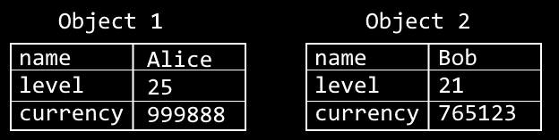
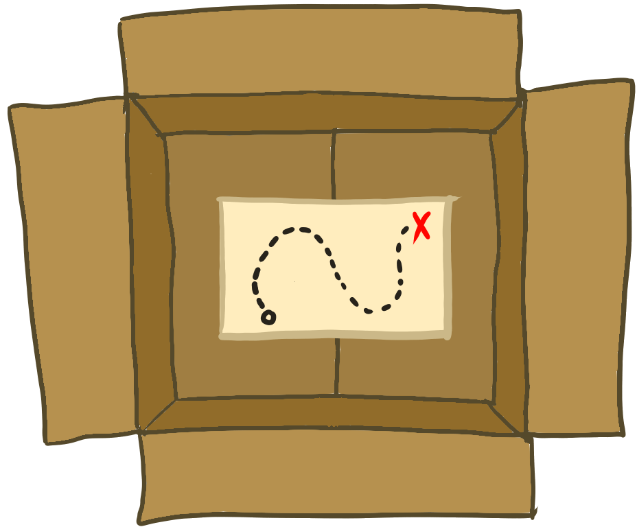

# 3.3 - Classes, Objects, and Reference Types

Java is an object-oriented programming language (OOP), so classes and objects are at the heart of Java. In this section, we will introduce the fundamentals of *using* classes and objects, and in a few chapters we will start defining our own. This understanding will allow us to start using Java's built in classes!

## Class Overview
A **class** defines an outline *for* an object. It defines both the *state* and *behavior*. With the exception of `static`, a class does not actually have its own state or behavior. Instead, you need to *construct* an object from that class, and that object will have its own state and behavior. One analogy is that a class is like a recipe, and an object is like a cookie. From just one recipe, you can make as many cookies as you want. Note that this "recipe" doesn't need to be followed exactly, there can be some minor changes (such as chocolate chip instead of peanut butter), but you will still get a cookie.

**State** refers to the state of the program at a specific time, which is a combination of all the different variables held in memory. In terms of classes and objects, state only refers to the variables in that class/object. For example, in a video game, the entire program state might include the current round, the round timer, the player's name, the player's level, and the player's currency. Then, more specifically, a `Player` class could have three variables for `name`, `level` and `currency`, and a `Game` class could have three more variables for `round`, `roundTimer`, and `player`.

**Behavior** refers to what an object can do, which is a combination of the *methods* defined in the class. In our game example, the `Game` class may have the method `startNextRound()`, which increments the `round` variable and resets the `roundTimer`. The `Player` class could have the method `levelUp()` which increments their `level` and gives them some bonus `currency`. Note that in both these examples, the state both influences the method's behavior *and* the method mutates (changes) the object's state.

A class is a *data type*, just like an `int` or `long` is. The difference is that a class is a **reference type**, which gets handled differently than the primitive type (like `int`) that we learned about in the last section.

## Object Overview
An **object** is an *instance of* a class. This means the data-type is the same as that of the class. This means when we declare a variable, it would be `ClassName variableName;`. As a concrete example, we could declare `Player alice;` and `Player bob;`. But how do we initialize them?

### Constructors and `new`
To create a new object, we use the `new` keyword followed by a *constructor*. A constructor uses the class name, followed by parenthesis (with or without arguments). For example, `new Player()` is using a constructor with no arguments, and `new Player("Alice")` is using a constructor with a single argument. In either case, the value returned from this expression is a reference to the newly created *object*.

Remember that we often declare *and* initialize a variable at the same time, and now we know the basics. Assuming we have a constructor that accepts 3 arguments (for name, level, and currency), we could write the following code to declare and initialize both Alice and Bob to newly constructed objects:
```java
Player alice = new Player("Alice", 25, 999_888);
Player bob = new Player("Bob", 21, 765_123);
```

Since each object (which is of type `Player` in this example) has its own state, the following image illustrates the resulting states from the code above:



While the variables defined in the `Player` class are only defined once, *each* object get their own set of those variables.

Don't be too overwhelmed with the details of constructing new objects - we will only use it a small amount over the next few chapters. The intent here is to bring awareness to the syntax for the few times that we use it, and in discussing references.

## Variables and References
This subsection is one of the most important topics in all of Java programming. How do objects interact with variables? In section 3.1, we learned that variables held a value, using the box analogy. In that section, we only used primitive types in the examples.

For primitives types, they are small enough that the variable's value holds everything we care about, such as the integer value `25`. But with a reference type, the value is not *directly* the thing we care about - it is *not the object*. In the `Player` example, `alice` does not store any of the object's information (name, level, currency). Instead, the *value* of the variable is a *reference* to that object. This *reference* is a special number that represents a location in memory that the Java Virtual Machine (JVM) can use to find the real object, which stores  the object's state. In our box analogy, think of this reference variable as storing a treasure map on where to find the object (treasure):



In a way, the variables *point* to an object, but *aren't* the object. This is why in the diagram for Alice and Bob's state, I labeled them with "Object 1" and "Object 2", since the variable names `alice` and `bob` simply *point* to those objects, which don't have a name, only a location.

### The Stack and Heap
The **heap** is a region of memory where all objects are stored. It is dynamically allocated during at runtime, and exists throughout the entire execution. When we use the `new` keyword to construct an object, that object is placed into the heap. The heap is a slower than the stack because the JVM needs to use the "treasure map" to find the correct object in memory. This layer of indirection is why it is a little slower.

The **stack** is a contiguous region of memory where all local variables and method calls are stored, per thread. A **stack frame** is created each time a new method is called, and destroyed after the method returns. The stack frame holds the state of that method, which are the local variables. The local variables can be primitive or reference types, but in the case of reference types the JVM needs to use the heap to find the real object. The stack is faster because the primitive variables do not need to be searched for on the heap, and exist directly.


### Duplicate References
Because an object lives on the heap, and reference variables *refer* to an object on the heap, we have have *multiple* reference variables pointing to the *same* object on the heap. This is both very powerful and *very dangerous*. 

### Null


### Garbage Collection

## Methods
### Return Types
### Arguments and Parameters
### Static Methods
### Instance Methods

An **object** is an *instance of* a class, and it has the same data type. A class is declared once, but multiple objects can be constructed from it.


// Need to talk about references/pointers and objects and variables and boxes

// class members, methods, fields
// static and non-static

 with the same data type. An object is *constructed* from a class with the `new` operator.


Sometimes a class is used in an analogy with a blueprint or recipe, but I prefer to avoid those because it implies the result will always be the same. 

